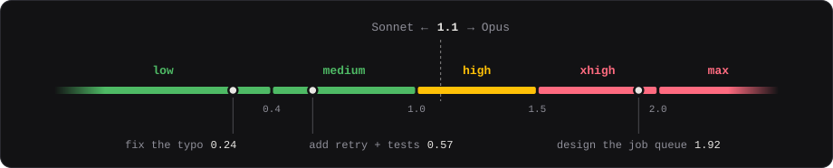

<div align="center">

# model-router

**Sonnet or Opus for the session. An effort level for every prompt.**<br>
Picked by a classifier that runs on your machine.

[](#requirements)
[](#requirements)
[](LICENSE)

<br>



<sub>One session. Scores and latencies are real classifier output for these prompts.</sub>

<br>

[Install](#install) · [First run](#first-run) · [How it routes](#how-a-prompt-is-routed) · [Troubleshooting](#troubleshooting)

</div>

<br>

A Claude Code mod that routes each session to **Sonnet 5.5 or Opus 5.5** and each prompt to an **effort level**, using [GLiNER2.5-Decide](https://huggingface.co/fastino/GLiNER2.5-Decide) running locally.

- **The model is picked once**, from the session's first prompt. Switching models mid-conversation throws away the prompt cache, so the model stays fixed after that.
- **Effort is picked again on every prompt.** Short replies ("yes", "go ahead") keep the last effort.
- **A band above the prompt** shows the model, the effort, how long classifying took, and last turn's cache-read %.

## Requirements

- Claude Code **2.1.287 or later** (`claude --version`)
- macOS or Linux
- `curl`. If [`uv`](https://docs.astral.sh/uv/) isn't installed, the first session installs it to `~/.local/bin` (no shell profile edits), and uv fetches a suitable Python (3.10–3.13) by itself.
- About 2 GB of free RAM while the classifier runs, and about 2 GB of disk for torch and the weights

## Install

In Claude Code:

```
/plugin marketplace add DustinVerzal/magic-router
/plugin install model-router@magic-router
```

Restart Claude Code. That's all. The first session installs and starts the classifier itself (see [First run](#first-run)).

<details>
<summary><b>Warm it up first</b>: skip the first-run download wait</summary>
<br>

Without this step, your first session waits while torch installs and the weights download. To do that ahead of time:

```sh
git clone https://github.com/DustinVerzal/magic-router
magic-router/scripts/gliner.sh setup
```

`setup` installs uv if it's missing, installs torch and gliner2, downloads the weights (~1.7 GB), and leaves the daemon running. The downloads land in uv's and Hugging Face's shared caches, so the installed plugin reuses them; the clone is only needed to run the script.

</details>

<details>
<summary><b>From source</b>: load a checkout to hack on it</summary>
<br>

To hack on it, load a checkout for one session instead of installing:

```sh
git clone https://github.com/DustinVerzal/magic-router
claude --plugin-dir ./magic-router
```

Edits to `hooks/` reload while the session runs.

</details>

## Updating

Updates ship when the plugin version is bumped, which happens automatically on every merge to `main`. Third-party marketplaces don't auto-update by default, so turn it on once:

1. Run `/plugin` and open the **Marketplaces** tab.
2. Select **magic-router** and choose **Enable auto-update**.

Claude Code then pulls new versions at startup and asks you to restart or run `/reload-plugins`. To update by hand instead:

```
/plugin marketplace update magic-router
/plugin update model-router@magic-router
```

## First run

The first session after a reboot starts the classifier daemon (`server/classifier.py`, on `127.0.0.1:8765`). The daemon keeps running after the session ends, and every later session reuses it.

| When | What happens |
|---|---|
| **First run ever** | uv installs (if missing), then torch and gliner2 install, and the weights download (~1.7 GB). The band shows `classifier unreachable` until this finishes, and the session keeps its own model. |
| **First session after a reboot** | The model loads in about 10 s, and the first prompt waits for it. |
| **Every later prompt** | About 0.3 s of CPU. |

## Managing the classifier

```sh
scripts/gliner.sh setup    # install uv if missing, install torch + gliner2, download the weights, start
scripts/gliner.sh start    # start the daemon (if it isn't up) and wait until the model is loaded
scripts/gliner.sh stop     # stop the daemon
scripts/gliner.sh status   # print /health
scripts/gliner.sh check    # run the classifier's offline self-check
scripts/gliner.sh logs     # follow the daemon log
```

The log is at `~/.cache/model-router/classifier.log`. Without a checkout, stop the daemon with `pkill -f server/classifier.py`.

## How a prompt is routed

All routing policy lives in [`hooks/route.ts`](hooks/route.ts). The daemon only answers the questions the mod sends it.

1. **Task type**: one probability distribution over seven labels. Each label maps to an eval family of the [Artificial Analysis Intelligence Index v4.1](https://artificialanalysis.ai/articles/artificial-analysis-intelligence-index-v4-1):

   | Label | Eval family |
   |---|---|
   | `agentic_coding` | Terminal-Bench |
   | `scientific_coding` | SciCode |
   | `tool_use` | τ³-Bench |
   | `knowledge_work` | GDPval-AA |
   | `long_context` | AA-LCR |
   | `knowledge_qa` | AA-Omniscience, GPQA |
   | `reasoning` | HLE, CritPt |

2. **Complexity**: seven independent yes/no signals, such as `multi_file`, `planning`, `deep_reasoning`, `large_scope`, and `quick`.
3. **Score**: `Σ weight × P(signal) + Σ bias × P(task)`. The task bias leans toward Opus where its lead on the matching evals is widest.
4. **Effort and model**: the score maps to `low < 0.4 ≤ medium < 1.0 ≤ high < 1.5 ≤ xhigh < 2.0 ≤ max`. On the first prompt, a score ≥ 1.1 picks Opus; anything lower picks Sonnet.



> [!NOTE]
> The weights and thresholds were tuned by eye on 15 prompts, so retune them on your own traffic: fork the repo, edit `hooks/route.ts`, and load your fork with `--plugin-dir`.

## When it stands aside

- **Subagents**: their requests keep their own model and effort.
- **`/model`, `/effort`, or a fallback**: if any of these changes what the engine asks for, the router stops rewriting for the rest of the session.
- **Classifier unreachable on the first prompt**: the session keeps its own model, and effort routing starts once the daemon answers.
- **`/clear`**: the next prompt picks a model again.

## Troubleshooting

| Symptom | Fix |
|---|---|
| Band says `classifier unreachable` | Run `scripts/gliner.sh start` and read the log it names. On a first run, it's usually still downloading. |
| Daemon never starts from Claude Code, but `gliner.sh start` works | Read `~/.cache/model-router/classifier.log`: the uv install or a torch download likely failed (offline, proxy). |
| Band says `stood aside` | You picked a model or effort by hand (`/model`, `/effort`). `/clear` to let the router pick again. |
| Port 8765 is taken by something else | Stop that process; the port is fixed in `hooks/register.tsx` and `scripts/gliner.sh`. |

## Uninstall

```
/plugin uninstall model-router@magic-router
/plugin marketplace remove magic-router
```

Then stop the daemon (`pkill -f server/classifier.py`) and, to reclaim the disk, delete `~/.cache/model-router` and the weights under `~/.cache/huggingface/hub/models--fastino--GLiNER2.5-Decide`.

## Development

```sh
claude plugin validate .
claude plugin test .                        # routing, stickiness, stand-aside, band
uv run --script server/classifier.py --check
```

## License

[MIT](LICENSE)
